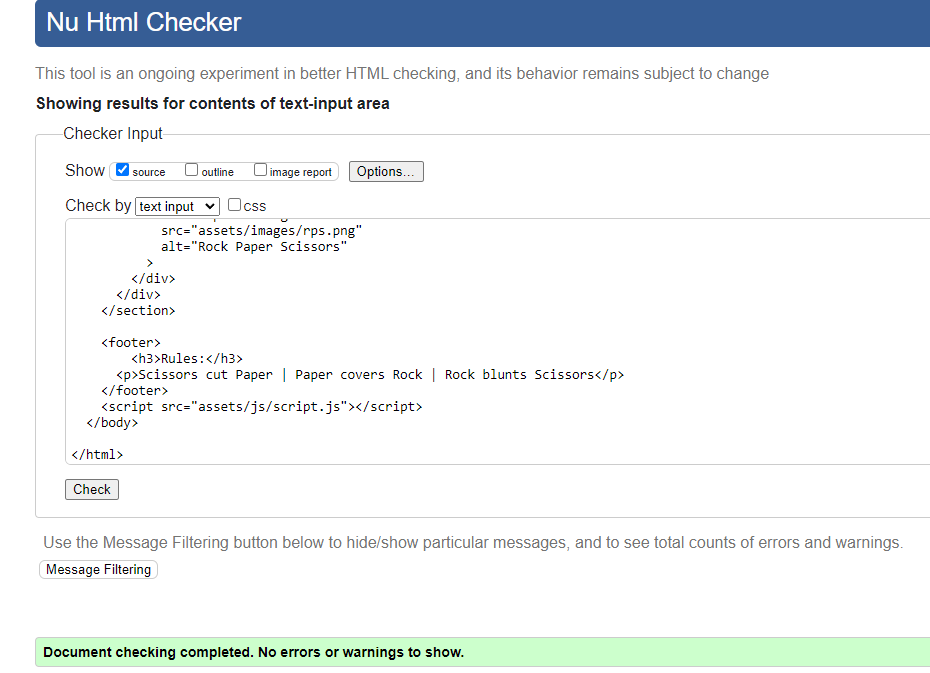
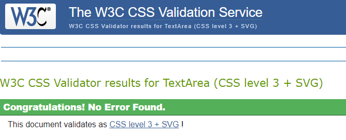

# Rock Paper Scissors Game

Rediscover the classic game of Rock, Paper, Scissors now in digital format.
Enjoy a quick and fun gaming experience for passing the time. Whether you are waiting for a bus, enjoying a break, or having competition with family, this version of rock paper scissors is here to bring joy and put smile on your face.

## Features

### **Header:**

* The Header if this online Rock, Paper, Scissors is situated at the top of the screen.

* It central placement makes it easey for players to identify the game title!
  

### **The Game Options:**

* Players can choose from 3 classic game options: Rock, Paper or Scissors.
* Variety ensures an exciting and engaging gaming experience that you just dont want to stop.

### **The Game Results:**

* After making a choice you await the game outcome.
* The results are clear and concise, with a point system to kepp track of the score.
* Whether you win, loose or there is a tie, the game provides feedback to keep you engaged and compettive.

### **The Footer:**

* The footer section provides essential information about about the game's rules.
* It add finishing touch to gaming experience, so you can be well informed and engaged.

## Testing

### *Manual Testing:*

* I tested the game functionality that it accurately determines the winner based on the chosen option.
* I verified that the game works on various browsers.
* I assesed the game's responsiveness on multiple devices such as smartphones, tablets and computers.
* I confirmed that the game scores update correctly after each round.
* I confirmed that the colors and fonts chosen are easy to read and accessible by running it through lighthouse in devtools.
  

### *Bugs:*

* My game was not working because i forgot to add "script=assets/js/script.js" to my HTML file.
* I had 2 errors in my HTML validators which i fixed. One of the was typo and the other was that I put "script=assets/js/script.js" under the "body" .
* I had couple of typos in my javaScript file but i fixed everything.

### *Validator Testing:*

## Deployment

##### The project was deployed to GitHub Pages. To deploy:

1. In the GitHub respository, navigate to the "Settings" tab.
2. In the "Source" section dropdown, select the "Master Branch".
3. Once the master branch is selected, the page provides a link to the completed website.

Website link: [Rock, Paper, Scissors](https://barry1701.github.io/rock_paper_scissors/)

## Credits

#### Content:

* Project was inspired by Portfolio 2 : Project Submission.

#### Media:

* The image of 3 hands was taken from internet browser and the cut into 3 different pieces by myself.
